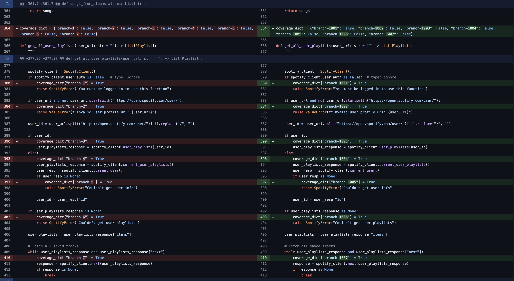
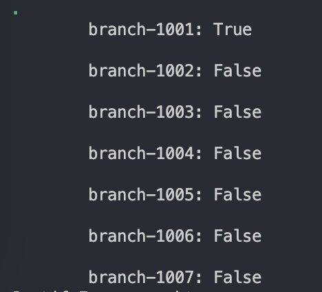

# Report for Assignment 1

## Project chosen

Name: Spotify Downloader

URL: [Shttps://github.com/spotDL/spotify-downloader](https://github.com/spotDL/spotify-downloader)

Number of lines of code and the tool used to count it: Lizard counted 95 KLOC

Programming language: Python

## Coverage measurement

### Existing tool

<Inform the name of the existing tool that was executed and how it was executed>

<Show the coverage results provided by the existing tool with a screenshot>

### Your own coverage tool

<The following is supposed to be repeated for each group member>

Erik Doytchinov

get_all_user_playlists

<Group member name>

<Function 1 name>

<Show a patch (diff) or a link to a commit made in your forked repository that shows the instrumented code to gather coverage measurements>

<Provide a screenshot of the coverage results output by the instrumentation>

## Coverage improvement

### Individual tests

<The following is supposed to be repeated for each group member>

Erik Doytchinov

test_get_all_user_playlists_with_unautherized_acc

<Show a patch (diff) or a link to a commit made in your forked repository that shows the new/enhanced test>

<Provide a screenshot of the old coverage results (the same as you already showed above)>

<Provide a screenshot of the new coverage results>

<State the coverage improvement with a number and elaborate on why the coverage is improved>

<Test 2>

<Provide the same kind of information provided for Test 1>

<Group member name>

<Test 1>

<Show a patch (diff) or a link to a commit made in your forked repository that shows the new/enhanced test>

<Provide a screenshot of the old coverage results (the same as you already showed above)>

<Provide a screenshot of the new coverage results>

<State the coverage improvement with a number and elaborate on why the coverage is improved>

<Test 2>

<Provide the same kind of information provided for Test 1>

### Overall

<Provide a screenshot of the old coverage results by running an existing tool (the same as you already showed above)>

<Provide a screenshot of the new coverage results by running the existing tool using all test modifications made by the group>

## Statement of individual contributions

<Write what each group member did>
