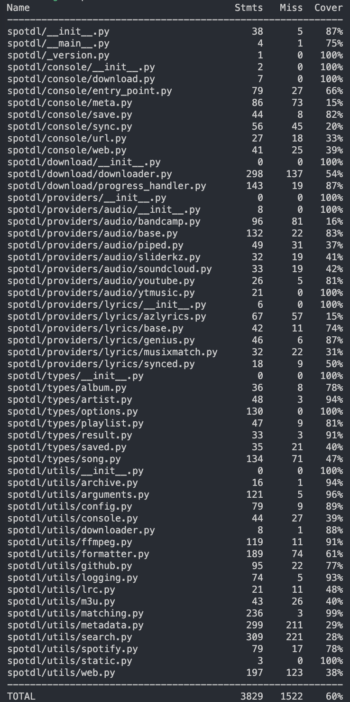
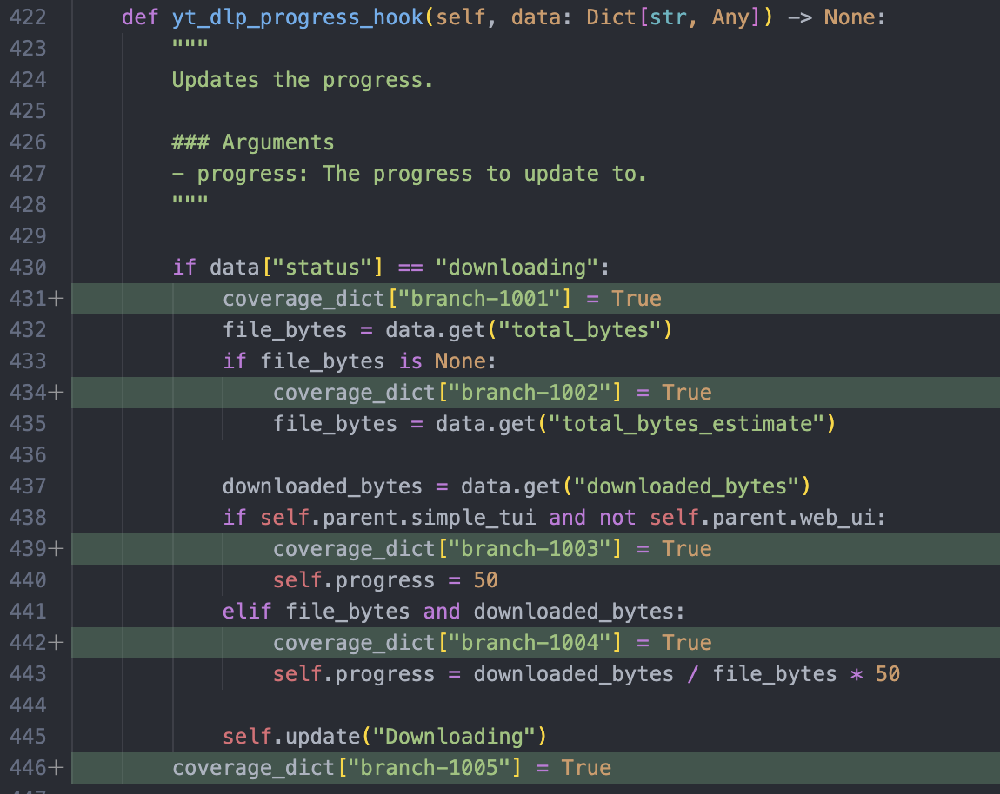
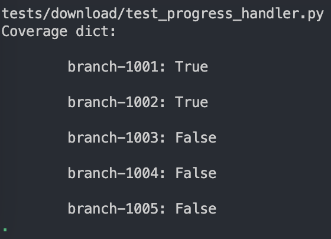
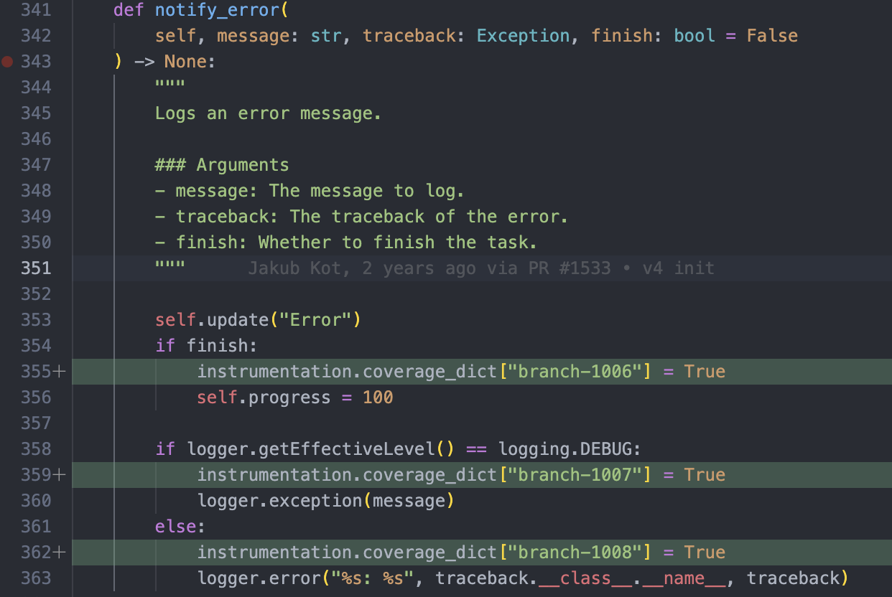
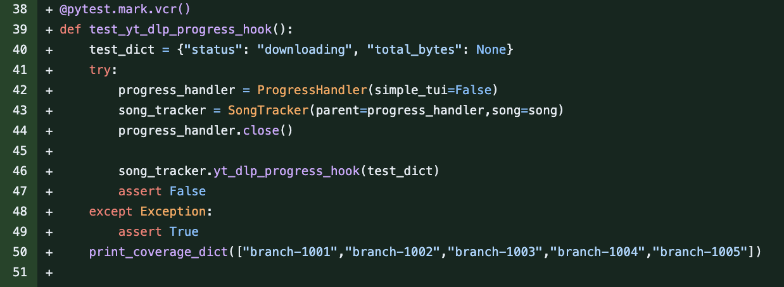
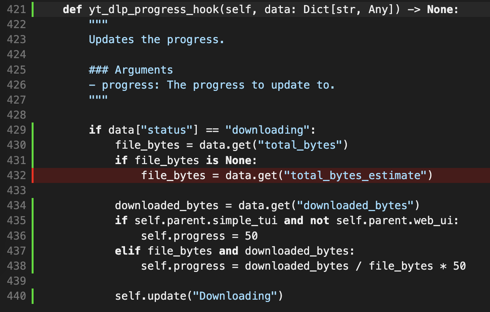
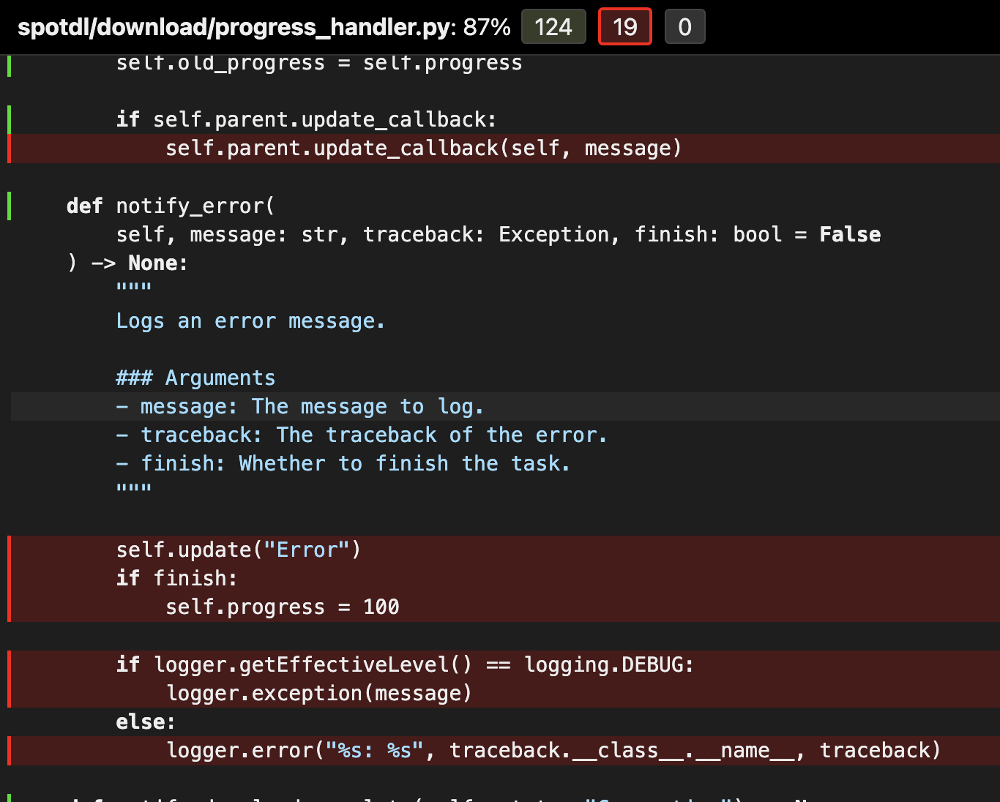
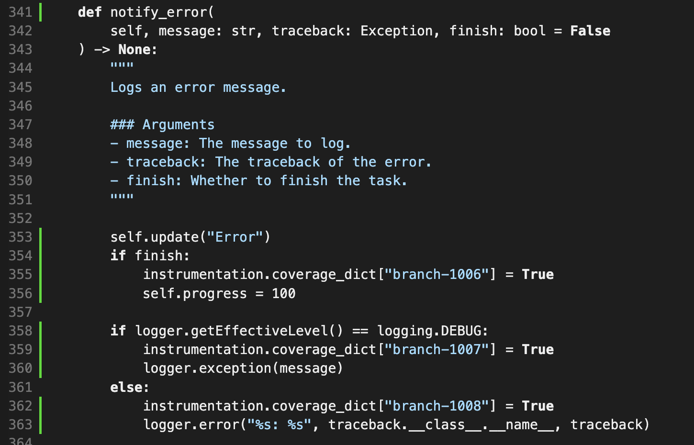

# Report for Assignment 1

## Project chosen

Name: Spotify Downloader

URL: [Shttps://github.com/spotDL/spotify-downloader](https://github.com/spotDL/spotify-downloader)

Number of lines of code and the tool used to count it: Lizard counted 95 KLOC

Programming language: Python

## Coverage measurement

### Existing tool

We used Coverage.py for our test and we ran "coverage run pytest", then "coverage report" to get the table bellow.

### Your own coverage tool

<The following is supposed to be repeated for each group member>

Erik Doytchinov

yt_dlp_progress_hook()

notify_error()

## Coverage improvement

### Individual tests

Erik Doytchinov

test_yt_dlp_progress_hook()

Added a test scanario that covers the missing branch, in the case that no file byte size is included.

notify_error()

At first there was no test coverage at all but now all branches are covered.

<Group member name>

<Test 1>

<Show a patch (diff) or a link to a commit made in your forked repository that shows the new/enhanced test>

<Provide a screenshot of the old coverage results (the same as you already showed above)>

<Provide a screenshot of the new coverage results>

<State the coverage improvement with a number and elaborate on why the coverage is improved>

<Test 2>

<Provide the same kind of information provided for Test 1>

### Overall

<Provide a screenshot of the old coverage results by running an existing tool (the same as you already showed above)>

<Provide a screenshot of the new coverage results by running the existing tool using all test modifications made by the group>

## Statement of individual contributions

<Write what each group member did>
