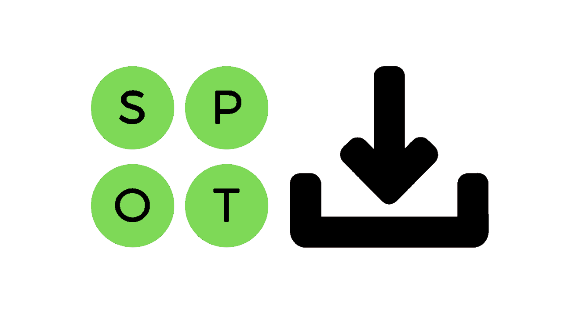

# spotDL

> The fastest, easiest, and most accurate command-line music downloader

[](https://github.com/spotDL/spotify-downloader/blob/master/LICENSE)  
[](https://pypi.org/project/spotdl/) [](https://pypi.org/project/spotdl/) [](https://pypi.org/project/spotdl/)

What spotDL does:

1. Downloads music from YouTube as an MP3 file
2. Applies basic metadata gathered from spotify such as:
   - Track Name
   - Track Number
   - Album
   - Album Cover
   - Genre
   - and more!

### Announcing spotDL v3

We rebuilt spotDL from scratch to be much faster, simpler, and better than the old spotDL. The documentation is also a work in progress.

⚠ We have dropped active development of spotDL v2 due to support and maintainability. No focused efforts will be made to resolve v2 specific issues.

#### Join the [spotDL discussion](https://github.com/spotDL/spotify-downloader/discussions?discussions_q=category%3AGeneral)!

<br/>

## Installation

You need to download FFmpeg to use this tool. Download and installation instructions can be found at [FFmpeg.org](https://ffmpeg.org/)

- Recommended Stable Version:

  ```
  $ pip install spotdl
  ```

- Alternatively, for the latest version (not necessarily stable):

  ```
  $ pip install https://github.com/spotDL/spotify-downloader/archive/next-rel-dev.zip
  ```

_The availability of YouTube Music in your country is important for spotDL to work since we use YouTube Music to filter out our search results. To check if YouTube Music is available in your country, visit [YouTube Music](https://music.youtube.com)._

## Usage (instructions for v3)

- To download a song, run:

  ```
  $ spotdl [trackUrl]
  ```

  ex. `spotdl https://open.spotify.com/track/08mG3Y1vljYA6bvDt4Wqkj?si=SxezdxmlTx-CaVoucHmrUA`
  <br/>

- To download an album, run:

  ```
  $ spotdl [albumUrl]
  ```

  ex. `spotdl https://open.spotify.com/album/2YMWspDGtbDgYULXvVQFM6?si=gF5dOQm8QUSo-NdZVsFjAQ`
  <br/>

- To download a playlist, run:

  ```
  $ spotdl [playlistUrl]
  ```

  ex. `spotdl https://open.spotify.com/playlist/37i9dQZF1DWXhcuQw7KIeM?si=xubKHEBESM27RqGkqoXzgQ`
  <br/>

- To search for and download a song, run (with quotation marks):
  _(Note: This may not be very accurate)_

  ```
  $ spotdl '[songQuery]'
  ```

  ex. `spotdl 'The HU - Sugaan Essenna'`

    <br/>

- To resume a failed/incomplete download, run:

  ```
  $ spotdl [pathToTrackingFile]
  ```

  ex. `spotdl 'Sugaan Essenna.spotdlTrackingFile'`

  _`.spotDlTrackingFiles` are automatically created when a download starts, and deleted on completion_

<br/>

You can queue up multiple download tasks by separating the arguments with spaces:

```
$ spotdl [songQuery1] [albumUrl] [songQuery2] ... (order does not matter)
```

ex. `spotdl 'The Hu - Sugaan Essenna' https://open.spotify.com/playlist/37i9dQZF1DWXhcuQw7KIeM?si=xubKHEBESM27RqGkqoXzgQ ...`

<br/>

_spotDL downloads up to 4 songs in parallel, so try to download albums and playlists, instead of tracks for a faster experience._

## `pipx` isolated environment alternative

For users who are not familiar with `pipx`, you can use it to run the script _without_ installing the spotDL package and all the dependencies globally with pip. (Effectively skipping over the [Installation](https://github.com/spotDL/spotify-downloader#Installation) step)

First you will need `pipx`

```
python3 -m pip install --user pipx
python3 -m pipx ensurepath
```

Then you can jump directly to running spotDL with:

```
pipx run spotdl ...
```

## For Developers and Contributors

1. Clone this repository
   ```
   $ git clone https://github.com/spotDL/spotify-downloader.git
   $ cd spotify-downloader
   ```
2. Setup venv (optional)
   - Windows
     ```
     $ py -3 -m venv env
     $ .\.venv\Scripts\activate
     ```
   - Linux/macOS
     ```
     $ python3 -m venv .venv
     $ source .venv/bin/activate
     ```
3. Install requirements
   ```
   $ pip install -e .
   ```

- Use as Command (no need to re-install after file changes)
  ```
  $ spotdl [ARGUMENTS]
  ```

## Thanks for developing v3

1. [@ritiek](https://github.com/ritiek) for creating and maintaining spotDL for 4 years
2. [@rocketinventor](https://github.com/rocketinventor) for figuring out YouTube Music querying
3. [@Mikhail-Zex](https://github.com/Mikhail-Zex) for, never mind...

## A few interesting forks

1. [aasmpro/spotify-downloader](https://github.com/aasmpro/spotify-downloader)
   - Sets metadata for songs that are already downloaded (v2 only.)
