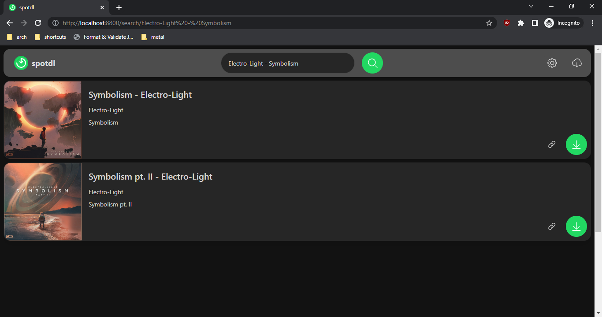

# spotDL Installation Guide

spotDL is a free and open source tool that downloads your Spotify playlists & music

> **The fastest, easiest, and most accurate command-line music downloader**

## Install via Python

> This is our recommended installation method.

If you are on Windows, Install Visual C++ Redistributible (link below) and then proceed to
install Python & FFmpeg

### Prerequisites to spotDL

- [Visual C++ 2019 redistributable](https://docs.microsoft.com/en-us/cpp/windows/latest-supported-vc-redist?view=msvc-170#visual-studio-2015-2017-2019-and-2022)
  (on Windows)
- Python 3.7 or above (added to PATH)
- FFmpeg 4.2 or above (added to PATH)

### Install Python to PATH

> We recommend installing the latest version of Python

When installing [Python](https://python.org/), ensure to select "**Add to PATH**".


### Installing spotDL

> If you are not on Windows (e.g. OSX/UNIX), replace `pip` with `pip3` and `python` with
> `python3` in all commands.

Firstly, open a terminal. On Windows: Command Prompt, OSX: "Terminal", \*UNIX: Bash or Zsh.

Verify you have installed Python correctly via `python -V`. Ensure you have v3.7 or greater.

Next, install spotDL by typing the following

```shell
pip install spotdl
```

### Installing FFmpeg

If using FFmpeg only for spotDL, you can install FFmpeg to your local directory.
`spotdl --download-ffmpeg` will download FFmpeg to your spotDL installation directory.

We reccomend the above option, but if you want to install FFmpeg system-wide,

- [Windows Tutorial](https://windowsloop.com/install-ffmpeg-windows-10/)
- OSX - `brew install ffmpeg`
- Linux - `sudo apt install ffmpeg` or use your distro's package manager

If you require further help, ask in our [Discord Server](https://discord.gg/xCa23pwJWY)

[](https://discord.gg/xCa23pwJWY)

## Using Prebuilt Executable

### Download the executable

You can download the latest version from from the
[Releases Tab](https://github.com/spotDL/spotify-downloader/releases)

### Running Web UI

Web UI will start by default if no arguments are passed to the command line (after
double-clicking for example)



### Running the CLI

To use the command line interface just open your terminal and run
`./spotdl-vX.X.X operation [urls]`

## Docker Setup

spotDL provides a Docker image.

Install Docker: <https://docs.docker.com/engine/installation/>

Install Docker Compose: <https://docs.docker.com/compose/install/>

Docker documentation: <https://docs.docker.com/>

### Built-in Docker Image

- Build docker image `docker build -t spotdl .`
- List spotdl options: `docker run --rm spotdl --help`
- Download a song:
  `docker run --rm -v $(pwd):/music spotdl download https://open.spotify.com/track/0VjIjW4GlUZAMYd2vXMi3b`

### Docker Hub Image

- Pull docker image from Docker hub: `docker pull spotdl/spotify-downloader`

- Download a song using Docker image:
  `docker run --rm -v $(pwd):/music spotdl/spotify-downloader download https://open.spotify.com/track/0VjIjW4GlUZAMYd2vXMi3b`

- Create a Docker container

```
docker create \
  --name=spotdl \
  -v <path to data>:/music \
  spotdl/spotify-downloader
```

### Docker Compose

- Create a container using Docker Compose: `docker-compose up --no-start`
- Download a song using Docker compose:
  `docker-compose run --rm spotdl download https://open.spotify.com/track/0VjIjW4GlUZAMYd2vXMi3b`

## Other Installation Methods

### Termux

We have a dedicated Termux installation script
`curl -L https://raw.githubusercontent.com/spotDL/spotify-downloader/master/scripts/termux.sh | sh`

### Arch User Repository (AUR) package

[You can find the AUR Package here](https://aur.archlinux.org/packages/python-spotdl)

## Where does spotDL download songs?

spotDL downloads files to the folder where you ran spotDL from.

Open pwsh/powershell/cmd/terminal/similar in the folder you want files to download to, or cd to
desired folder.

**Windows Shortcut:** Navigate to the folder you want the files to download to.
`SHIFT + RIGHT CLICK`, then select "Open PowerShell window here"


## We have a public Discord server at **[discord.gg/xCa23pwJWY](https://discord.gg/xCa23pwJWY)!**

[](https://discord.gg/xCa23pwJWY)
